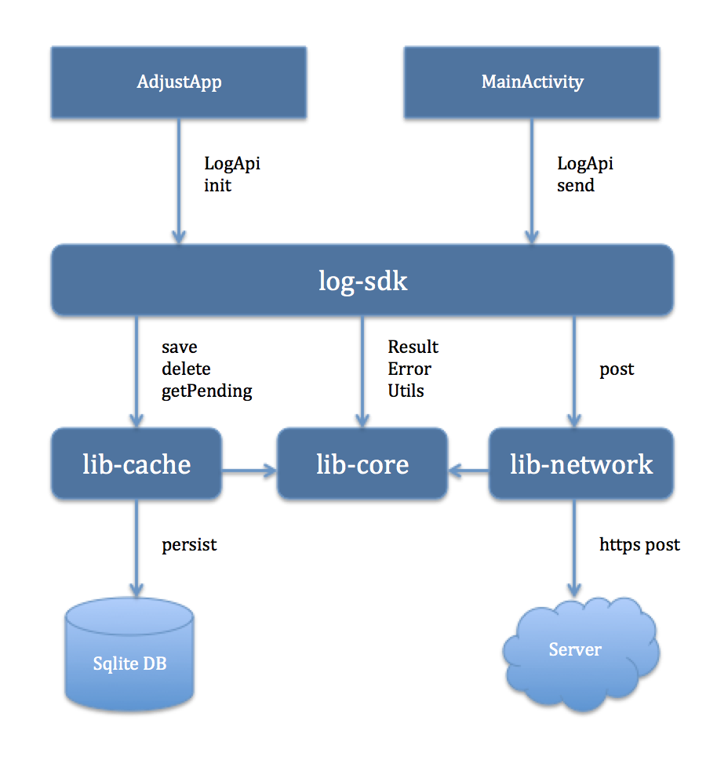

# Event Tracking SDK
This project intent to implement the Android SDK which receives the user event and post it to server synchronously

## Approach

The project architecture follows modular approach where the logical components are divided into below modules.  

## Modules
•	app  
•	log-sdk  
•	lib-cache  
•	lib-network  
•	lib-core  
•	test  

## app

This is sample android app with UI having **Send** button.   
On each start of app, the **LogApi** gets initialized.   
On click of this button, the current time (seconds of a minute)  will get posted to **log-sdk** via **LogApi.send()** 

## log-sdk

This is Android Library which exposes the LogApi handle.  It exposes the following APIs –  
**init**  - It initializes the SDK and also process any pending events available in cache.  
**send** – It receives the user event as current time in seconds, saves it in the cache and then process all pending events available in cache synchronously in the order of arrival.  It also rejects any duplicate events (reported at the same second of that minute)

## lib-cache

This is Android Library with allows saving of event to process, deleting the procesed events and retrieving the pending event for processing in the order of occurance.  It uses the sqlite database for caching purpose.  

## lib-network

This is Android Library which allows posting the event to server and returning the server response.  It uses the Android *HttpsURLConnection* for HTTP Post implementation.

## lib-core

This is Android Library which intent to implement all the classes and methods, which can be used across all modules.

## test

This is test app which intent to cover all possible **Unit Tests** and **Instrumentation Tests** for all the modules.

## FLOW

## Environment – 

•	Android Studio 3.1

## Note - 

•	This project can be enhanced further by API documentation and more test cases.  
•	The two application package – app & test shares the same content provider name, so they are mutually exclusive.  So, **uninstall** one of them while installing other.
